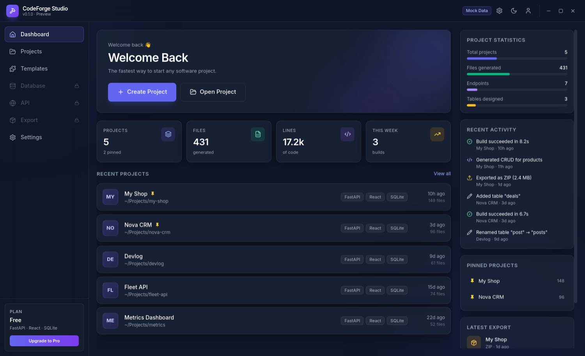
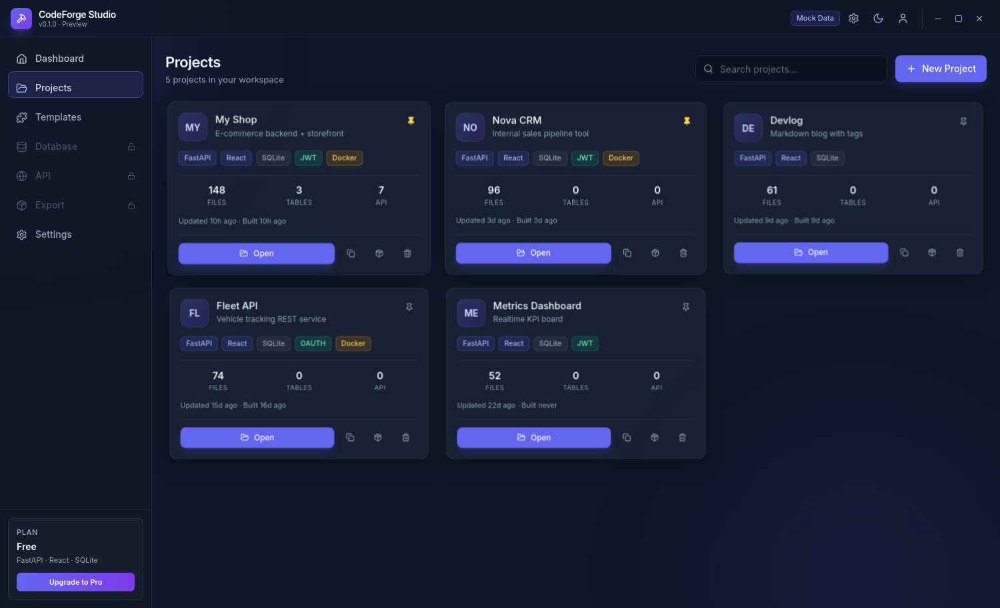
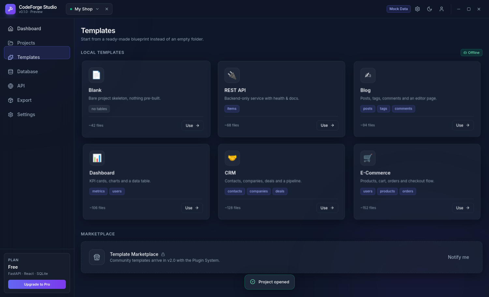
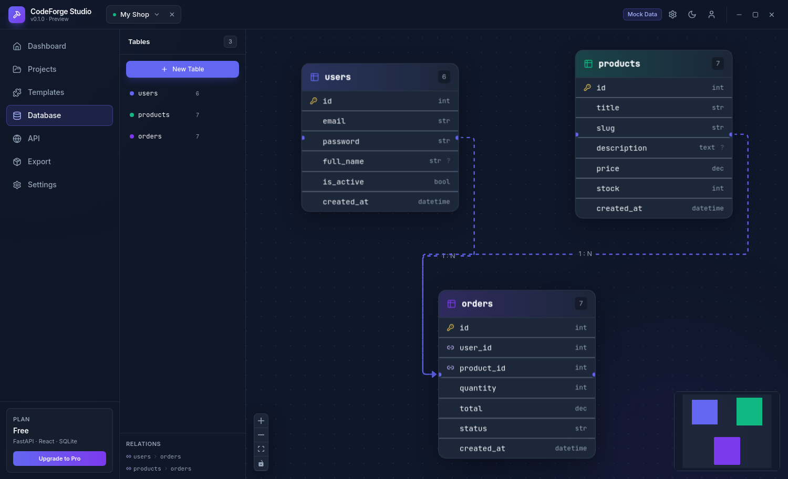
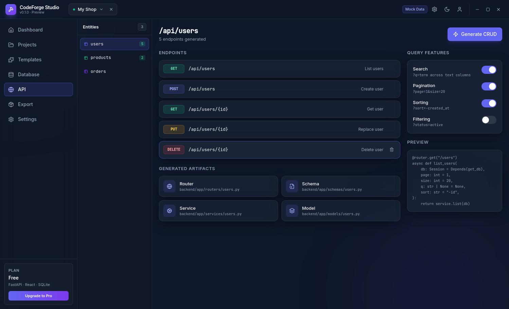
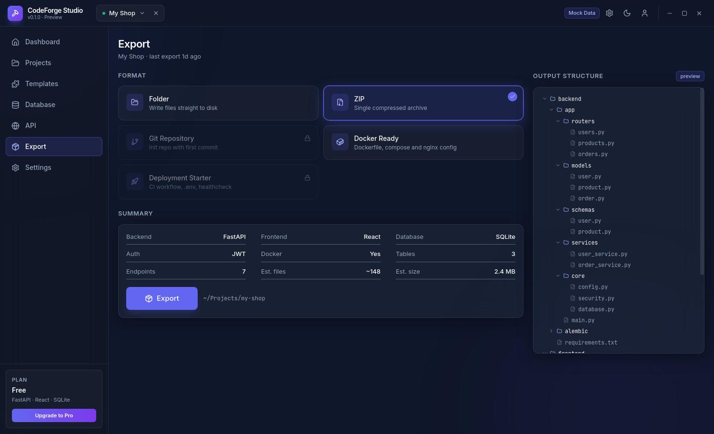
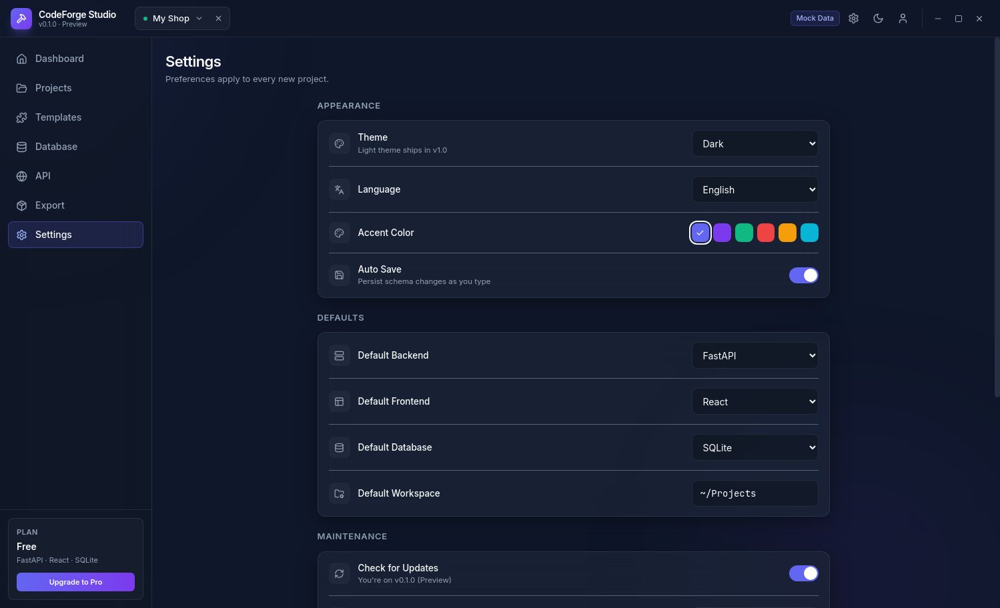
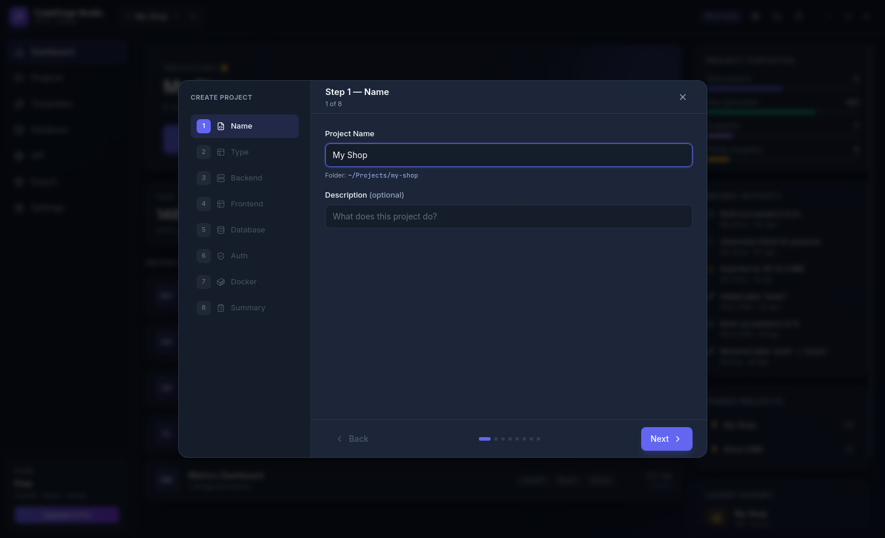
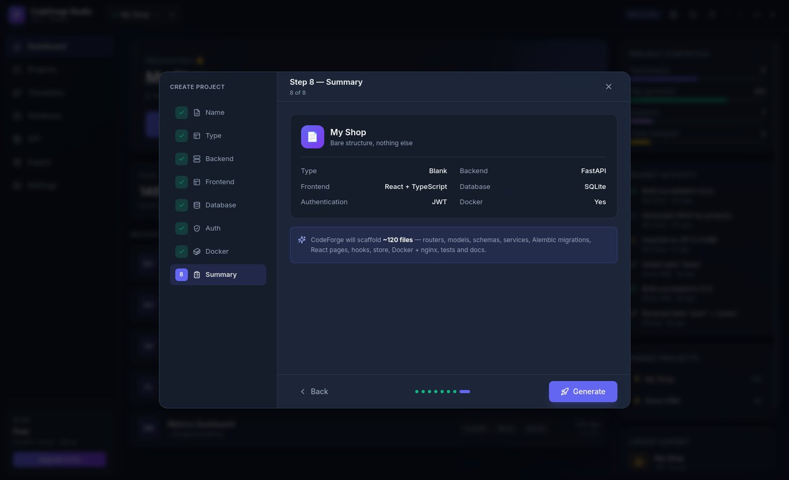

# 🚀 Skaffo

**The fastest way to start any software project.**

> **Free and open source.** Every feature is unlocked — no paid tier, no
> account, no telemetry. Your projects never leave your machine.
>
> Formerly *CodeForge Studio*; renamed to **Skaffo** in v0.8.



---

## ▶️ Run it

**Requirements:** [Node.js 18+](https://nodejs.org) and [Python 3.10+](https://python.org)
(on Windows, tick *"Add Python to PATH"* during install).

```bash
git clone https://github.com/ilia-dev-cmyk/skaffo.git
cd skaffo
npm install

# once — creates the Python virtualenv for the engine
setup-engine.bat        # Windows
./setup-engine.sh       # macOS / Linux

npm run dev             # Vite + Electron + Python engine
```

Other scripts:

| Command | What it does |
|---|---|
| `npm run dev` | Vite + Electron + Python engine (hot reload) |
| `npm run dev:web` | Browser + engine, http://localhost:5273 |
| `npm run engine` | Python API only — docs at http://127.0.0.1:8731/docs |
| `npm run build` | Type-check + production bundle into `dist/` |
| `npm run electron` | Launch Electron against the built `dist/` |

---

## ✅ What works right now

Everything below is **real, clickable UI** running on in-memory state:

| Screen | Status |
|---|---|
| **Dashboard** | 3-column layout, live stats, recent projects, activity feed, pinned, latest export/build |
| **Projects** | Grid, search, pin/unpin, delete, open |
| **Templates** | 6 local templates, marketplace placeholder |
| **Database Designer** | React Flow canvas, drag tables, PK/FK icons, drag-to-connect relations, column inspector (type, nullable, unique, default), rename/duplicate/delete |
| **API Designer** | Entity list from schema, Generate CRUD, endpoint list, query-feature toggles, live code preview |
| **Export** | 5 formats, animated progress, expandable output tree |
| **Settings** | Theme, language, accent, defaults, backup/restore, live plugin list |
| **Wizard** | All 8 steps, stepper rail, validation, summary, Generate → creates project in state |

Verified in a headless Electron run: **all 12 screens render, 0 console errors.**

---

## 🏗 Architecture — the main rule

> **Every part must be independent (plugin-based).**

```
src/
├─ core/                  ← the only shared layer
│  ├─ types.ts            Schema, Project, Plugin contract
│  ├─ registry.ts         PluginRegistry + event bus
│  ├─ store.ts            Zustand — single source of truth
│  └─ mock.ts             Phase-1 fixtures (deleted in Phase 2)
├─ ui/                    design system (Card, Button, Sidebar, Topbar…)
├─ plugins/               ← every feature is a plugin
│  ├─ dashboard/
│  ├─ projects/
│  ├─ templates/
│  ├─ database/           Database Designer
│  ├─ api/                API Designer
│  ├─ export/             Export Engine
│  ├─ settings/
│  ├─ wizard/
│  └─ index.ts            registration only
└─ App.tsx                shell + router
electron/
├─ main.cjs               window, IPC, custom titlebar
└─ preload.cjs            contextBridge — no nodeIntegration
```

**The contract every generator must satisfy:**

```ts
interface SkaffoPlugin {
  id: string;
  capabilities: ('generator' | 'designer' | 'exporter' | 'template')[];
  generate?(ctx: ProjectContext): Promise<GeneratedFile[]>;
}
```

A plugin is a **pure function**: context in, `GeneratedFile[]` out. It never touches disk.
Only the Export Engine writes files — which is why preview, dry-run and ZIP come for free.

No plugin imports another plugin. They only know `@core`.

---

## 🎨 Design system

| Token | Value |
|---|---|
| Background | `#0F172A` |
| Sidebar | `#111827` |
| Primary | `#6366F1` |
| Hover | `#7C3AED` |
| Success | `#10B981` |
| Danger | `#EF4444` |
| Card | `#1E293B` |
| Text | `#F8FAFC` |

Font **Inter** (+ JetBrains Mono for code) · Icons **Lucide React** · Animations fade / slide / scale @ **200ms** · Dark mode + glass effect throughout.

---

## 📸 Screens

| | |
|---|---|
|  |  |
|  |  |
|  |  |
|  |  |

---

## 🗺 Build order

- [x] **Phase 1** — Electron + React shell, all screens
- [x] **Phase 2** — FastAPI sidecar + SQLite persistence
- [x] **Phase 3** — Project Generator + **Re-generate/Sync**
- [x] **Phase 4** — Validation · SQL export · Import · Undo/Redo
- [x] **Phase 5** — Custom endpoints · OpenAPI · generated tests
- [x] **Phase 6** — ZIP · dry run · diffs · run scripts ← you are here
- [ ] **v1.0** — Installer, icon, onboarding, auto-update

Decisions and risks behind this order: [`docs/REVIEW.md`](docs/REVIEW.md).

---

## 🔒 Locked into v1 scope

FastAPI · React · SQLite. Every other stack option is visible but disabled — deliberately.
One stack done properly beats eight done halfway.

---

## 📄 License

MIT

---

## ☕ Support

Skaffo is free and stays free. If it saved you time:

⭐ Star the repo · 🐛 Report a bug · 🔗 Tell a friend

Crypto donations are welcome but entirely optional — see
[docs/SUPPORT.md](docs/SUPPORT.md).
